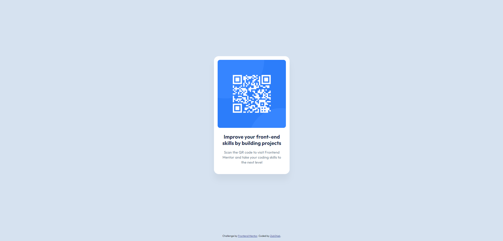

# Frontend Mentor - QR code component solution

This is a solution to the [QR code component challenge on Frontend Mentor](https://www.frontendmentor.io/challenges/qr-code-component-iux_sIO_H). Frontend Mentor challenges help you improve your coding skills by building realistic projects. 

### Built with

- Semantic HTML5 markup
- CSS custom properties
- Flexbox
- Mobile-first workflow
- Figma

### Useful resources

- [How To Center a Div](https://www.joshwcomeau.com/css/center-a-div/) - The Ultimate Guide to Centering in CSS. This tutorial lists the most useful centering patterns and explains when and which methods to use.